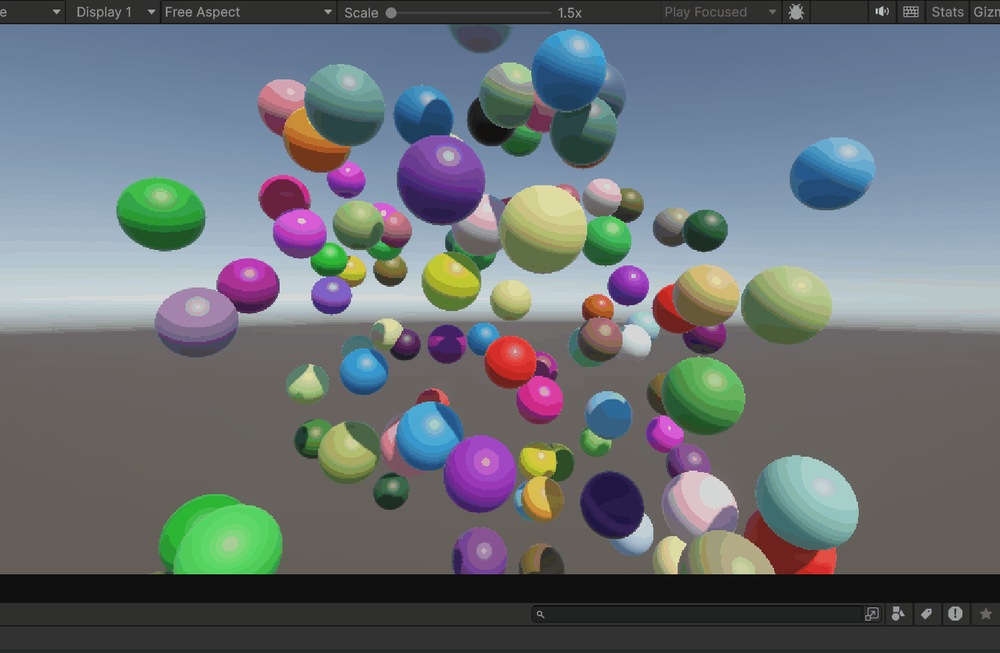
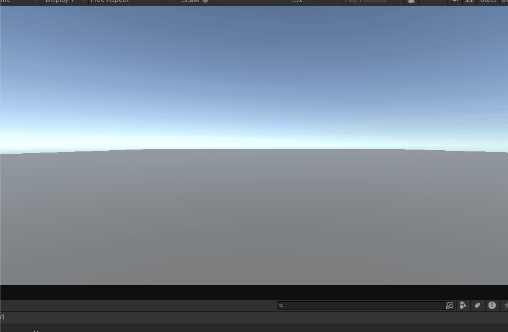
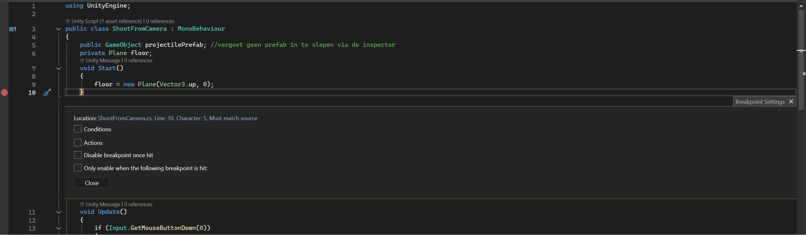
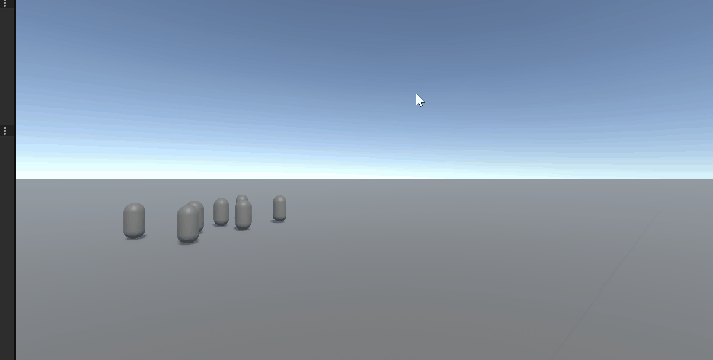
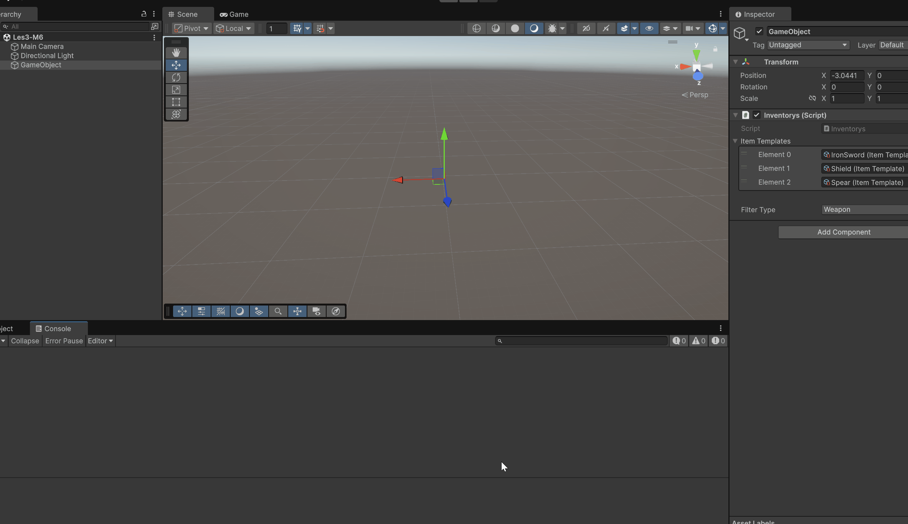
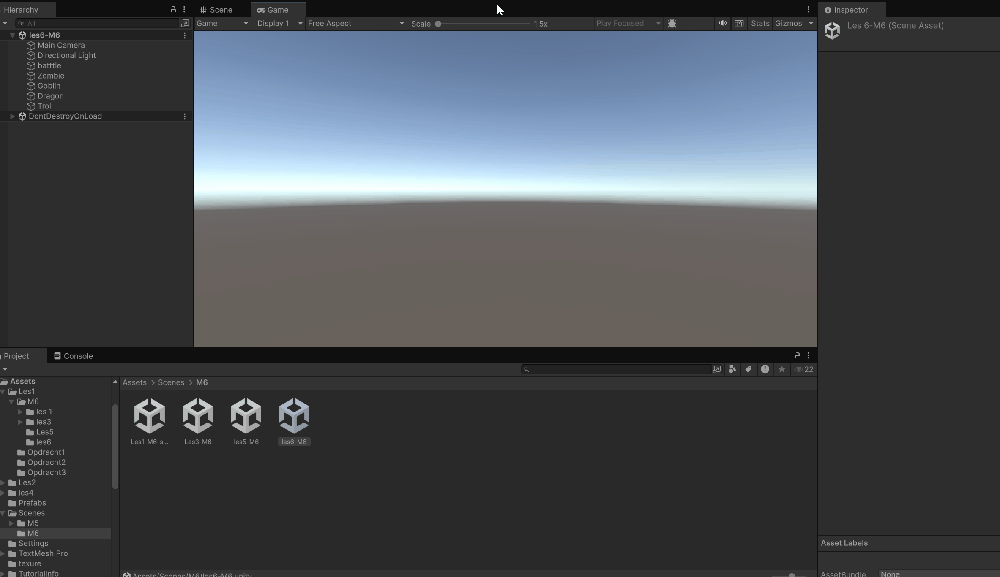

# Progm5

## Les1

### Opdracht 1 

In Deze Opdracht is een refreser op return types en fucties en Methods
en Parameters.
Dus ik moets 100 ballen spawnen en dan laten verdwijnenen da na elke seconde 1 tje laten spawnen
[script](Assets/Les1/Opdracht1)

### Opdracht 2

Deze Opdracht is een Refreser over  Class, Object, Constructor & Instantiate
De opdracht was dat waneer een knop werk gedrukt een tower spawnde met een random localscale
de knop bij mij Space
[script](Assets/Les1/Opdracht2)

### Opdracht 3

De laatse refreser Opdracht ging over loops en arrays.
ik heb zelf geen arrays gebruiket de knoppen zijn
W = 100 spawnen
3 elke seconde
X voor verwijderen
[script](Assets/Les1/Opdracht3)

## Les2

### Opdracht 1 

In Deze Opdracht moest ike leren over action events en hoe je ze moet gebruike.
Ik heb er veel nieuws van geleerd en ook Bonus Opdracht gedaan van willekeurig nummer van score per coin.
ook heb ik gezord dat de coins random spawnen binnen een radius het is nu op de floer maar kan ik veranderen met 1 nummertje
Vond dit  erg leerzaam
[script](Assets/Les2/Opdracht1)
## Les3

### Opdracht 1

ShotRange is 0
Player is met een extra r

### Opdracht 2
opdracht 4 kon ik niet doen want tower defense was al in geleverd
[Bo](https://github.com/lopy2323/Bo-M3/tree/main)

### Opdracht 3



## Les4

### Opdract 1 / 2

In Deze les moet is Dry leren en SRP ik moest een space game moberen meer uit elkaar tehalen
IK heb de Begin message een string van gemaakt en dat checked de message programma zodat hij extralang er blijf / je zou dan specialen dingen makelijk kunnen doen
ik heb rotation en movment een aparte class gemaakt.
[repo](https://github.com/lopy2323/Space48)

## Les5

### Opdracht 1

In deze Les heb ik inhertince geleerd met classes.
ik heb een elf die snel is maar 1 shot en een brute die super slowm maar veel hp heeft zo als de opdracht vrog
[scripts](Assets/Les4/opdracht8)

## Les6

[Bo](https://github.com/lopy2323/Bo-M3/tree/main)

# depedecy's

towernum get and set
howfar get and set

tiledata public because its a info class do not know how to get set that

## progm6

## les1


In deze les heb ik Code Conventies geleerd en een werkende inventory systeem gemaakt waarmee waneer je op space drukt laat weten wat op de gron en in de inventory zit
en als je q en e drukt om te roteren tussen items om te droppen dat je doet via F dit checked ook of je het ook echt in je invetory hebt

[scripts](Assets/Les1/M6/les1)

## les2

het lukte niet echt

## les3



ik heb in deze les geleerd hoe ik met sritabole object om moest gaan 
ook werden er nog wat anderen dingen laten gezien ik wist niet dat je het zo kon comineren ik deed de class in de class
dus dat was ook iets nuews

[scripts](Assets/Les1/M6/les3)

## les4


Deze Opdrach was gewoon de zelfde opdrach als m5 les 2 opdracht 1 en dus zag geen verscheel
want action event zijn een deel van delagets dus het is al goed gemaakt voor mijn gevoel
graag commentaar al moet het worden veranderedd

[script](Assets/Les2/Opdracht1)

## les5


hier heb ik geleerd hoe ik i metoode in een base class fraag en die kan activeren vanaf de collider
de code kijkt of het een colletabol is en zo ja convert hij het naar iets waar ik de collected() op kan uitvoeren
om zo makkelijk meerderen dingen tedoen zonder moeite
ik had eerst voor de collectabole manger een dicanary met een vector 3 want ik wou het noaw keriger maar toen dacht ik het is helamaal niet nodig voor de opdracht

[scripts](Assets/Les1/M6/Les5)

## les6 



ik heb in deze opdracht een troll gemaakt 
de troll heeft 50% kans om tehelen dus in de gif duurt het bestwel lang om het tezien
maar de trool heeft ook 300 hp en ik heb alle berichten veranderd ik had de template gepakt van de goblin
dat ging veransend snel.

[scripts](Assets/Les1/M6/les6)

## les7
```C#
public bool IsPlayerReadyToAttack(Player player)
{
    if (player == null)
    {
     return false;
    }
    if (!player.IsAlive)
    {
     return false;
    }
    if (player.AttackCooldown > 0)
    }
     return false;
    }
     if (player.Target == null)
    {
    return false;
    }
    if (!player.Target.IsAlive)
    {
    return false;
    }
    if (Vector3.Distance(player.transform.position, player.Target.transform.position) > 5f)
    {
    return false;
    if (player.Mana < 20)
    {
    return false;
    }
    if (player.WeaponEquipped)
    {
    return false;
    }
    if (player.Health < 30)
    {
    return false;
    }
    if (!player.HasBuff("Strength"))
    {
    return false;
    }
    if (player.IsStunned)
    {
    return false;
    }
    if (player.IsSlowed)
    {
    return false;
    }
    return true
 }
  ```


